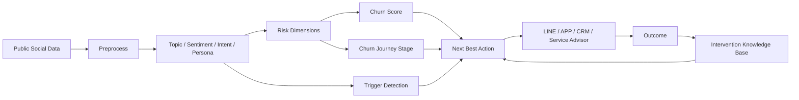

# System Architecture

```mermaid
flowchart LR
    A[Public Social Data] --> B[Preprocess]
    B --> C[Topic / Sentiment / Intent / Persona]
    C --> D[Risk Dimensions]
    D --> E[Churn Score]
    D --> F[Churn Journey Stage]
    C --> G[Trigger Detection]
    E --> H[Next Best Action]
    F --> H
    G --> H
    H --> I[LINE / APP / CRM / Service Advisor]
    I --> J[Outcome]
    J --> K[Intervention Knowledge Base]
    K --> H
```
